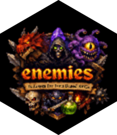

<!-- README.md is generated from README.Rmd. Please edit that file -->

```{r, include = FALSE}
knitr::opts_chunk$set(
  collapse = TRUE,
  comment = "#>",
  fig.path = "man/figures/README-",
  out.width = "100%"
)
```

# enemies 

<!-- badges: start -->
<!-- badges: end -->

The goal of enemies is to provide a collection of data sets of enemies from turn based RPGs.

This package will not contain data sets from collection based RPGs such as Pokemon and the Persona series.

## Installation

You can install the development version of enemies like so:

``` r
# install.packages("pak")
# pak::pak("emilhvitfeldt/enemies")
```

## Example

```{r example}
library(enemies)
```

```{r}
#| message: false
library(dplyr)

glimpse(finalfantasy_1)
```